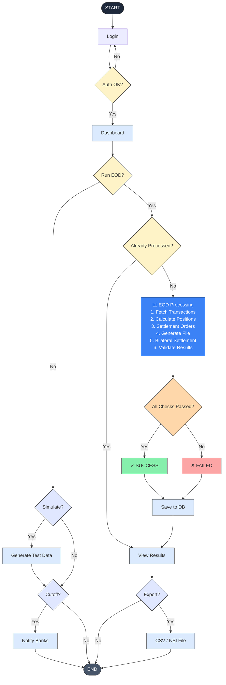

# Settlement EOD System - Flowchart

## How to Use

**In GitHub/GitLab:**
- Just view this `.md` file and Mermaid will render automatically

**In Notion/Obsidian/other Markdown editors:**
- Copy the code block above into your editor

**Online:**
- Paste the code at [mermaid.live](https://mermaid.live)

**In your documentation:**
- Embed in any Markdown-supporting tool that has Mermaid rendering enabled
